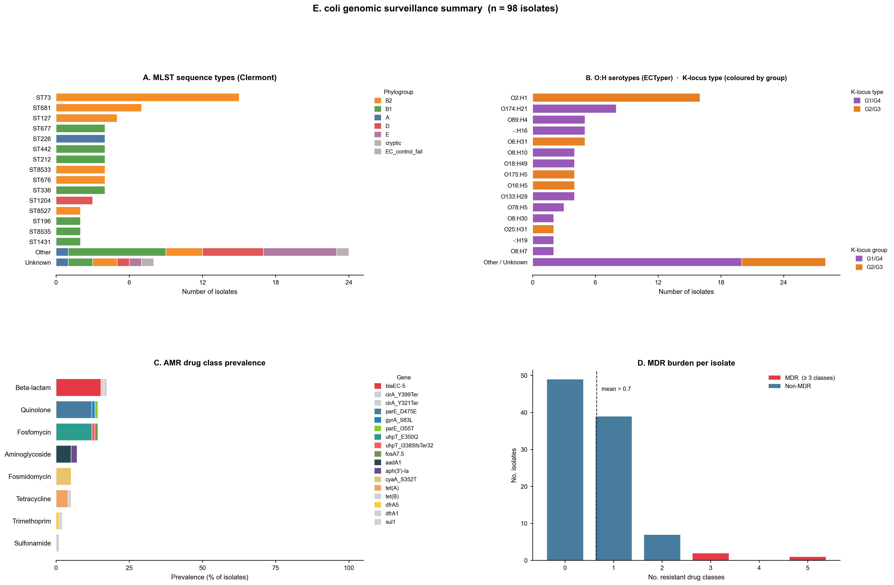
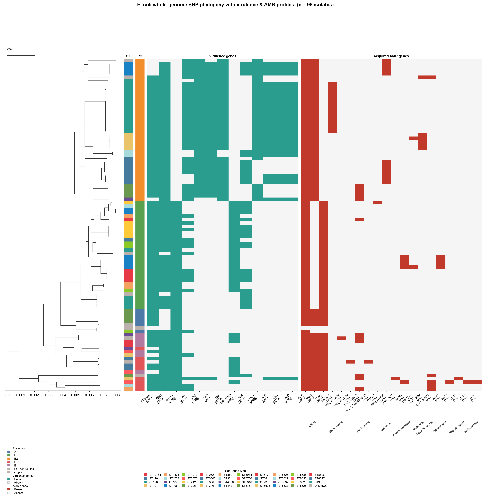
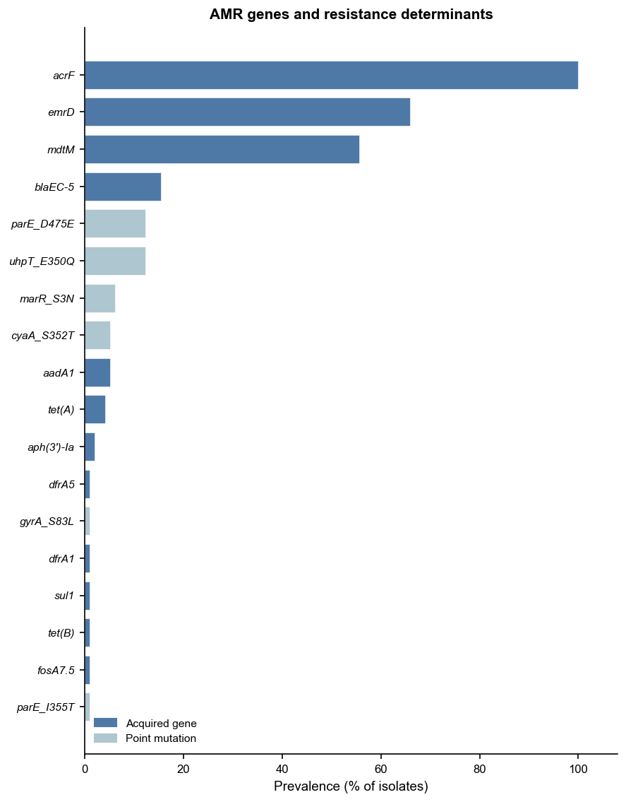
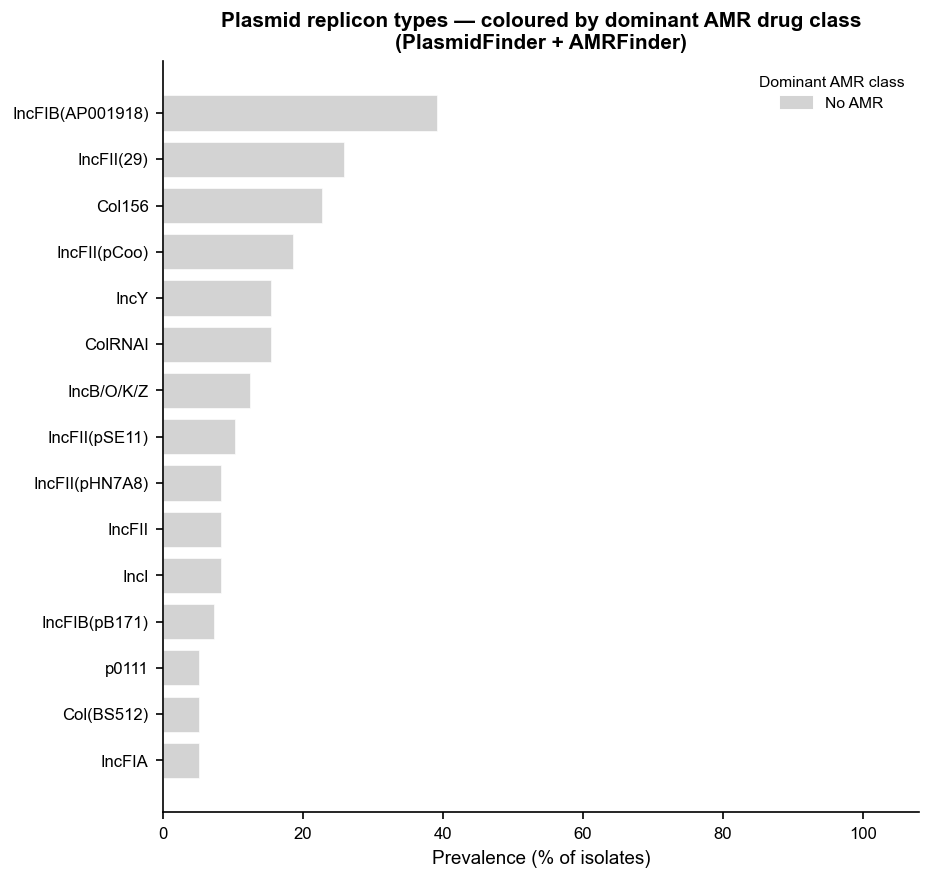
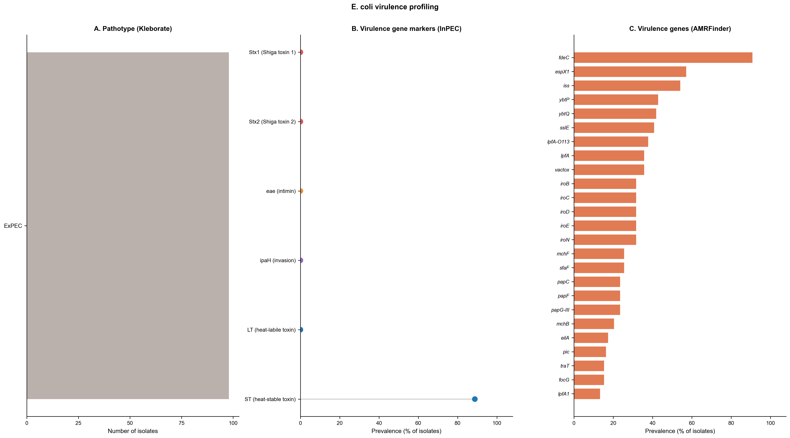
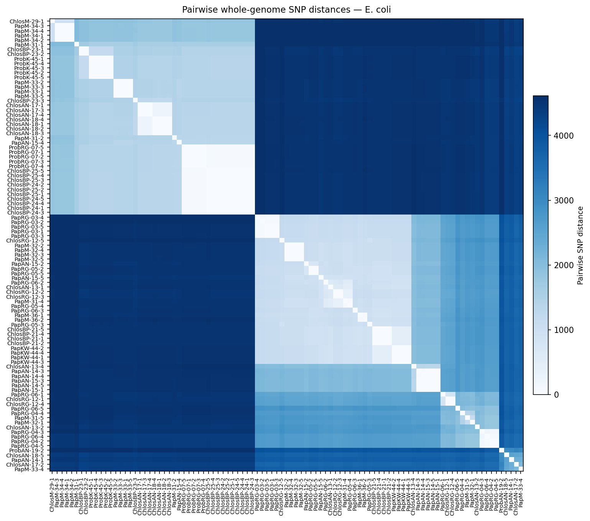

# Vignette: *Escherichia coli* — non-human primate gut isolates, The Gambia (n = 98)

This vignette demonstrates the outputs produced by **enteric-typer** when run on
98 *E. coli* genome assemblies from commensal gut isolates recovered from three
non-human primate (NHP) species in The Gambia.

---

## Sample set

Genomes are from [Foster-Nyarko et al. (2020) *Microbial Genomics* 6(10):
mgen000428](https://doi.org/10.1099/mgen.0.000428), a study characterising the
genomic diversity and antimicrobial resistance of commensal *E. coli* from NHP
gut microbiomes sampled across multiple field sites in The Gambia.
All raw sequencing reads and polished assemblies are deposited at NCBI under
**BioProject [PRJNA604701](https://www.ncbi.nlm.nih.gov/bioproject/PRJNA604701)**
(SRA: SRP247121).

### Host species and sampling sites

| Host species | Common name | Code prefix | n |
|---|---|---|---|
| *Chlorocebus sabaeus* | Green monkey | `Chlos` | 36 |
| *Papio papio* | Guinea baboon | `Pap` | 51 |
| *Piliocolobus badius* | Western red colobus | `Prob` | 11 |

Sample names encode the host species prefix, field site code, and individual ID
(e.g., `PapRG-04-2` = *Papio papio*, River Gambia site, animal 04, isolate 2).

### Individual sample accessions

All 98 SRR run accessions are available from BioProject
[PRJNA604701](https://www.ncbi.nlm.nih.gov/bioproject/PRJNA604701).
A selection of representative accessions is shown below; the full list is
available in the supplementary data of Foster-Nyarko et al. (2020).

| Sample | SRR Accession |
|---|---|
| ChlosAN-13-1 | SRR11015047 |
| ChlosAN-13-2 | SRR11015046 |
| ChlosBP-21-1 | SRR11015041 |
| PapAN-14-1 | SRR11015015 |
| PapM-31-1 | SRR11014999 |
| PapRG-03-1 | SRR11014976 |
| ProbRG-07-1 | SRR11014950 |
| ProbK-45-1 | SRR11014955 |

*(Full accession table: [PRJNA604701](https://www.ncbi.nlm.nih.gov/bioproject/PRJNA604701))*

---

## Run command

```bash
CONDA_SUBDIR=osx-64 nextflow run main.nf \
    -profile conda,arm64 \
    --input_dir nhp_e_coli_genomes/ \
    --outdir results/
```

---

## Output table (`ecoli_typer_results.tsv`)

One row per sample. Key columns:

| Column | Description |
|---|---|
| `mlst_st` | Achtman 7-gene MLST sequence type (`ecoli_achtman_4` scheme) |
| `mlst_st_complex` | MLST ST complex (where defined) |
| `kleborate_phylogroup` | Clermont phylogroup (A/B1/B2/C/D/E/F/G) assigned by Kleborate |
| `ectyper_serotype` | O:H serotype predicted by ECTyper |
| `ectyper_O` / `ectyper_H` | Individual O and H antigen calls |
| `k_group` / `k_locus` / `k_type` | K-locus group (G1/G4 or G2/G3), locus ID, and type |
| `k_confidence` | Kaptive typing confidence (Perfect / High / Low / Untypeable) |
| `kleborate_pathovar` | Pathotype markers detected by Kleborate (e.g., STEC, EAEC) |
| `amrfinder_acquired_genes` | Acquired AMR genes (intrinsic genes excluded by AMRrules) |
| `amrfinder_drug_classes` | Drug classes with acquired resistance |
| `plasmidfinder_replicons` | Plasmid replicon types detected by PlasmidFinder |

---

## Figures

### Fig 1 — Population summary

**Figure 1. Population-level summary of 98 *Escherichia coli* isolates from
non-human primate gut microbiomes in The Gambia.**
Four panels are shown. **(A)** Sequence type (ST) distribution: horizontal bar
chart of the top sequence types by count (Achtman 7-gene scheme). Commensal
*E. coli* from NHP hosts span a diverse range of STs, reflecting the broad
phylogenetic diversity typical of gut commensals.
**(B)** O:H serotype distribution coloured by K-locus group: stacked horizontal
bar chart where each bar represents a serotype (ECTyper) and fill colours
indicate the K-locus group — purple for G1/G4, orange for G2/G3 — enabling
rapid assessment of the K-locus landscape across circulating serotypes.
Serotypes not in the top 15 are grouped as "Other / Unknown"; bars retain the
K-locus group colours of their constituent isolates. A secondary legend shows
individual K-locus types within each group.
**(C)** Acquired AMR drug class prevalence: horizontal bar chart showing the
proportion of isolates carrying at least one acquired resistance gene per drug
class, with intrinsic resistance genes excluded.
**(D)** Multi-drug resistance (MDR): bar showing the proportion of isolates with
acquired resistance to ≥ 3 antibiotic classes.



---

### Fig 2 — Whole-genome SNP phylogeny with AMR & virulence profiles

**Figure 2. Whole-genome SNP phylogeny of 98 *Escherichia coli* NHP isolates
annotated with sequence type, Clermont phylogroup, virulence, and acquired AMR
profiles.**
The maximum-likelihood tree was inferred by IQ-TREE 2 (ModelFinder Plus
automatic model selection) from a whole-genome SNP alignment generated by SKA2
(split k-mer alignment, k=31) without a reference genome.
Reading left to right, annotation strips show: **sequence type (ST)** (coloured
by unique ST, legend below the figure); **Clermont phylogroup** (A/B1/B2/C/D/E/F/G;
coloured by group); **virulence gene presence/absence** (VFDB; teal = present,
light grey = absent); and **acquired AMR gene presence/absence** (red = present,
light grey = absent). Gene names are labelled along the bottom x-axis. The scale
bar (top left) represents substitutions per site.



---

### Fig 3 — Acquired AMR genes

**Figure 3. Prevalence of acquired antimicrobial resistance genes across 98
*Escherichia coli* NHP isolates.**
Horizontal bar chart showing the number of isolates carrying each acquired AMR
gene detected by AMRFinder Plus. Resistance genes are grouped and labelled by
drug class along the x-axis. Intrinsic resistance genes (as classified by
AMRrules) are excluded from the figure. The relatively low overall AMR prevalence
is consistent with the commensal, non-clinical source of these isolates.



---

### Fig 4 — Plasmid replicon types

No plasmid replicons were detected in this dataset.



---

### Fig 5 — Virulence genes

**Figure 5. Prevalence of virulence factor genes across 98 *Escherichia coli*
NHP isolates.**
Horizontal bar chart showing the number of isolates carrying each virulence gene
detected by AMRFinder Plus (virulence gene module). Genes are ordered by
prevalence. The presence of pathotype-associated virulence factors (e.g., STEC,
EAEC, ETEC markers) among commensal NHP isolates is consistent with findings
from the original study (Foster-Nyarko et al. 2020), which noted that NHP
*E. coli* carry diverse virulence repertoires despite their commensal context.



---

### Fig 6 — Pairwise whole-genome SNP distance heatmap

**Figure 6. Pairwise whole-genome SNP distance heatmap for 98 *Escherichia coli*
NHP isolates.**
Symmetric heatmap of pairwise SNP distances computed from the SKA2 whole-genome
SNP alignment. Samples are ordered by hierarchical clustering. Colour intensity
encodes SNP distance (lighter = more closely related, darker = more divergent).
Clusters of closely related isolates reflect shared STs or isolates from the
same host animal, consistent with the structured sampling design of the original
study.



---

## Reference

Foster-Nyarko E, Alikhan N-F, Ravi A, Thilliez G, Thomson NM, Baker D, Kay G,
Cramer JD, O'Grady J, Antonio M, Pallen MJ (2020). Genomic diversity of
*Escherichia coli* isolates from non-human primates in the Gambia.
*Microbial Genomics* **6**(10): mgen000428.
[https://doi.org/10.1099/mgen.0.000428](https://doi.org/10.1099/mgen.0.000428)
