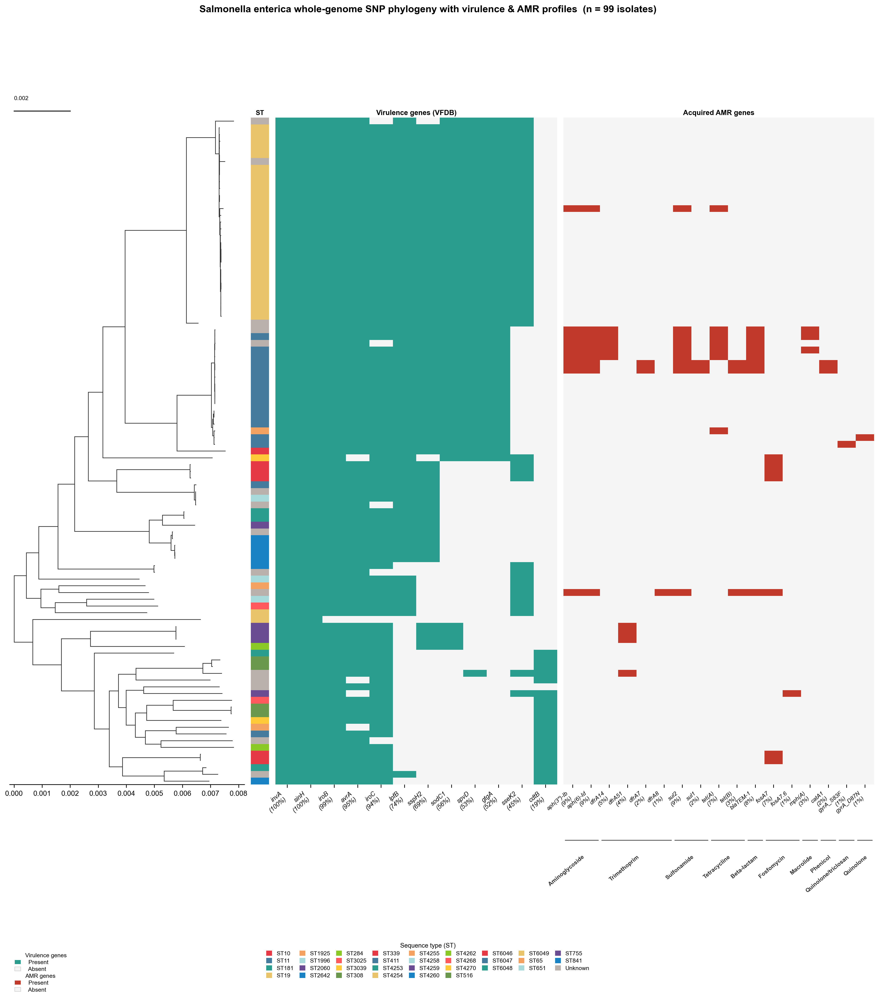
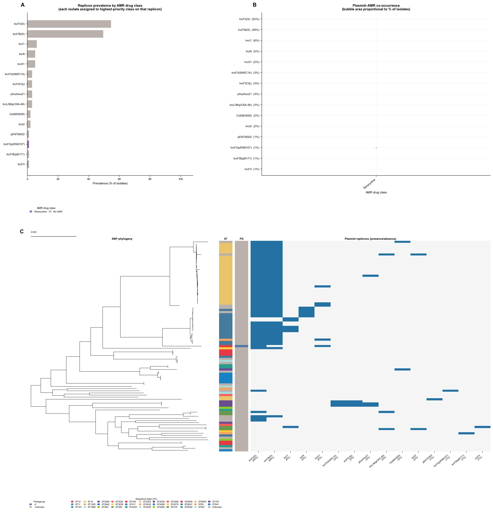
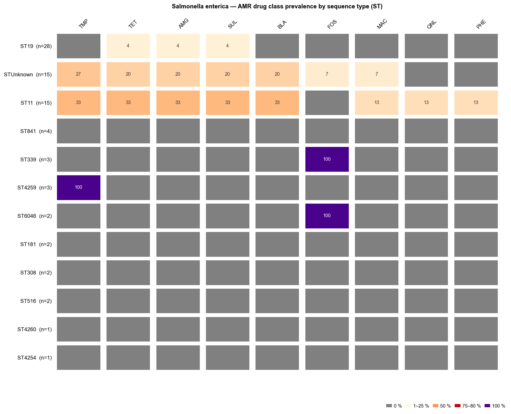
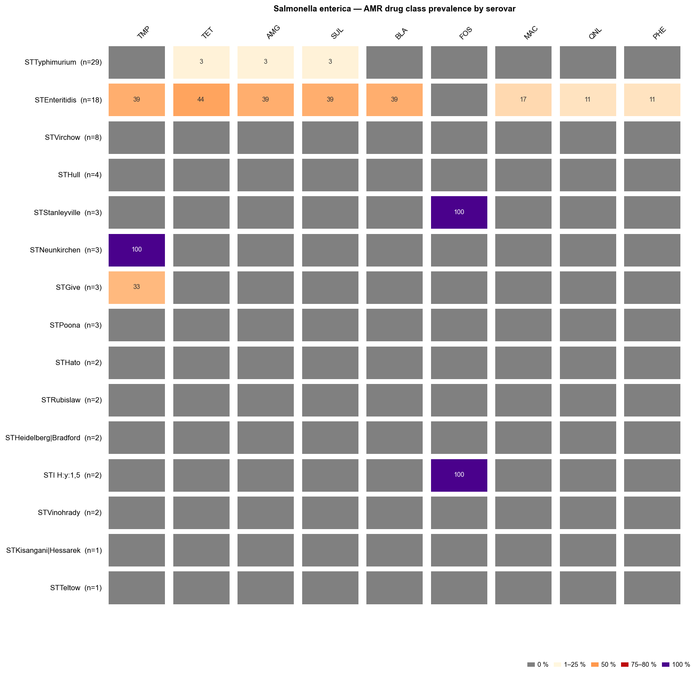
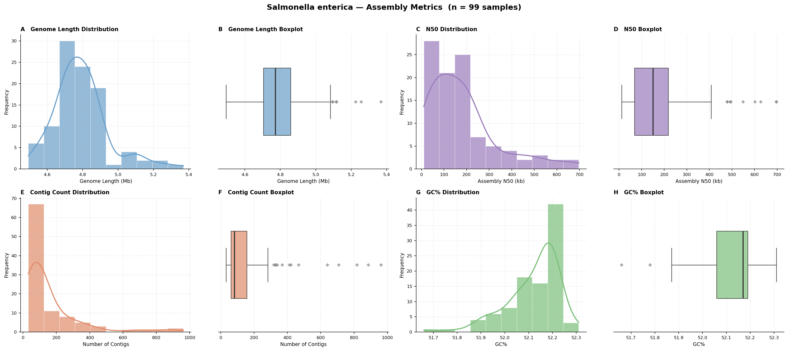

# Vignette: *Salmonella enterica* — clinical NTS isolates, The Gambia (n = 99)

This vignette demonstrates the outputs produced by **enteric-typer** when run on
99 non-typhoidal *Salmonella enterica* (NTS) clinical isolates from The Gambia.

---

## Sample set

Genomes are from [Darboe et al. (2022) *Microbial Genomics* 8(3):
mgen000785](https://doi.org/10.1099/mgen.0.000785), a study characterising
the genomic diversity and antimicrobial resistance of NTS associated with human
disease in The Gambia. Isolates were recovered from patients attending health
facilities in both Eastern Gambia (collected 2001) and Western Gambia (collected
2006–2018), covering invasive disease (bacteraemia) and gastroenteritis.

| Attribute | Detail |
|---|---|
| Species | *Salmonella enterica* (non-typhoidal) |
| Isolates | 99 (from 93 patients; some patients contributed >1 isolate) |
| Clinical source | Invasive (bacteraemia), gastroenteritis, other sites |
| Host | Human |
| Geography | The Gambia, West Africa |
| Collection period | 2001–2018 |
| Institution | MRC Unit The Gambia (MRCG) at LSHTM |
| BioProject | [PRJEB38968](https://www.ncbi.nlm.nih.gov/bioproject/PRJEB38968) (ENA/SRA) |
| Assemblies | ENA BioSamples [SAMEA6991082–SAMEA6991180](https://www.ebi.ac.uk/ena/browser/view/PRJEB38968) |

### Downloading assemblies from ENA

```bash
# Download all assemblies for BioProject PRJEB38968 using the ENA FTP
# (requires ena-ftp-downloader or wget; adjust as needed)
wget -r -nd -A "*.fasta.gz" \
    "https://www.ebi.ac.uk/ena/portal/api/filereport?accession=PRJEB38968&result=assembly&fields=submitted_ftp&format=tsv" \
    -O assembly_urls.tsv

# Or use the ENA browser to bulk-download assemblies:
# https://www.ebi.ac.uk/ena/browser/view/PRJEB38968
```

### Sample accessions

All 99 ENA BioSample accessions and their internal LSHTM identifiers (format `NNNN_YY`,
where `YY` is the 2-digit collection year):

<details>
<summary>Show all 99 accessions</summary>

| ENA BioSample | LSHTM ID |
|---|---|
| SAMEA6991082 | 02958_13 |
| SAMEA6991083 | 1004_07 |
| SAMEA6991084 | 1942_14 |
| SAMEA6991085 | 1820_14 |
| SAMEA6991086 | 3220_14 |
| SAMEA6991087 | 12276_11 |
| SAMEA6991088 | 8080_01 |
| SAMEA6991089 | 0559_17 |
| SAMEA6991090 | 1503_08 |
| SAMEA6991091 | 1521_08 |
| SAMEA6991092 | 2460_13 |
| SAMEA6991093 | 4178_15 |
| SAMEA6991094 | 1142_15 |
| SAMEA6991095 | 1920_14 |
| SAMEA6991096 | 3252_14 |
| SAMEA6991097 | 4289_14 |
| SAMEA6991098 | 3085_14 |
| SAMEA6991099 | 1169_07 |
| SAMEA6991100 | 3332_18 |
| SAMEA6991101 | 0664_15 |
| SAMEA6991102 | 1020_09 |
| SAMEA6991103 | 4278_06 |
| SAMEA6991104 | 2742_14 |
| SAMEA6991105 | 4159_15 |
| SAMEA6991106 | 3541_16 |
| SAMEA6991107 | 2933_14 |
| SAMEA6991108 | 1585_17 |
| SAMEA6991109 | 3653_13 |
| SAMEA6991110 | 27696_12 |
| SAMEA6991111 | 4165_15 |
| SAMEA6991112 | 0525_13 |
| SAMEA6991113 | 9710_11 |
| SAMEA6991114 | 0347_07 |
| SAMEA6991115 | 1967_08 |
| SAMEA6991116 | 5400_08 |
| SAMEA6991117 | 1156_08 |
| SAMEA6991118 | 9063_11 |
| SAMEA6991119 | 8876_10 |
| SAMEA6991120 | 0286_09 |
| SAMEA6991121 | 1221_07 |
| SAMEA6991122 | 1058_09 |
| SAMEA6991123 | 1427_09 |
| SAMEA6991124 | 4585_16 |
| SAMEA6991125 | 2214_18 |
| SAMEA6991126 | 0317_13 |
| SAMEA6991127 | 1076_01 |
| SAMEA6991128 | 4586_10 |
| SAMEA6991129 | 0796_06 |
| SAMEA6991130 | 3183_18 |
| SAMEA6991131 | 1789_17 |
| SAMEA6991132 | 3485_17 |
| SAMEA6991133 | 3610_17 |
| SAMEA6991134 | 0493_07 |
| SAMEA6991135 | 0065_14 |
| SAMEA6991136 | 3625_14 |
| SAMEA6991137 | 1004_01 |
| SAMEA6991138 | 0527_01 |
| SAMEA6991139 | 0008_01 |
| SAMEA6991140 | 0378_01 |
| SAMEA6991141 | 8078_01 |
| SAMEA6991142 | 4025_16 |
| SAMEA6991143 | 4030_15 |
| SAMEA6991144 | 4310_15 |
| SAMEA6991145 | 10136_01 |
| SAMEA6991146 | 8190_01 |
| SAMEA6991147 | 10136_02 |
| SAMEA6991148 | 8729_01 |
| SAMEA6991149 | 6650_01 |
| SAMEA6991150 | 9994_11 |
| SAMEA6991151 | 0851_15 |
| SAMEA6991152 | 0220_17 |
| SAMEA6991153 | 5423_17 |
| SAMEA6991154 | 4589_06 |
| SAMEA6991155 | 2408_13 |
| SAMEA6991156 | 1342_06 |
| SAMEA6991157 | 4273_17 |
| SAMEA6991158 | 0165_14 |
| SAMEA6991159 | 0253_01 |
| SAMEA6991160 | 0176_14 |
| SAMEA6991161 | 0197_14 |
| SAMEA6991162 | 4516_14 |
| SAMEA6991163 | 5797_16 |
| SAMEA6991164 | 4948_17 |
| SAMEA6991165 | 1177_07 |
| SAMEA6991166 | 4519_14 |
| SAMEA6991167 | 1921_14 |
| SAMEA6991169 | 1480_02 |
| SAMEA6991170 | 0189_01 |
| SAMEA6991171 | 0781_01 |
| SAMEA6991172 | 2385_01 |
| SAMEA6991173 | 3009_16 |
| SAMEA6991174 | 3970_15 |
| SAMEA6991175 | 8488_01 |
| SAMEA6991176 | 0123_01 |
| SAMEA6991177 | 8696_10 |
| SAMEA6991178 | 3978_17 |
| SAMEA6991179 | 0171_18 |
| SAMEA6991180 | 3276_18 |
| SAMEA9699386 | 0289_15 |

</details>

---

## Run command

```bash
nextflow run main.nf \
    -profile conda \
    --input_dir gambia_salmonella_assemblies/ \
    --outdir results/
```

---

## Output table (`salmonella_typer_results.tsv`)

One row per sample. Key columns:

| Column | Description |
|---|---|
| `mlst_st` | Achtman 7-gene MLST sequence type (`senterica_achtman_2` scheme) |
| `mlst_st_complex` | MLST ST complex (where defined) |
| `sistr_serovar` | Predicted serovar (SISTR, Kauffmann-White scheme) |
| `sistr_serovar_antigen` | Predicted antigen formula |
| `sistr_cgmlst_ST` | cgMLST330 sequence type (SISTR) |
| `sistr_O` / `sistr_H1` / `sistr_H2` | Predicted O and H antigens |
| `sistr_qc` | SISTR QC status (PASS / WARNING / FAIL) |
| `amrfinder_acquired_genes` | Acquired AMR genes (intrinsic genes excluded by AMRrules) |
| `amrfinder_drug_classes` | Drug classes with acquired resistance |
| `plasmidfinder_replicons` | Plasmid replicon types detected by PlasmidFinder |

---

## Figures

### Fig 1 — Population summary

**Figure 1. Population-level summary of 99 clinical non-typhoidal *Salmonella enterica*
isolates from The Gambia.**
Four panels are shown. **(A)** Sequence type (ST) distribution: horizontal bar
chart of MLST STs by count (Achtman 7-gene scheme, `senterica_achtman_2`),
reflecting the dominant lineages circulating in Gambian NTS disease.
**(B)** Serovar distribution coloured by MLST sequence type: stacked horizontal
bar chart where each bar represents a serovar predicted by SISTR and fill colours
indicate MLST sequence types (up to the top 12 STs are shown individually;
remaining STs are grouped as "Other" and isolates with no ST call as "Unknown").
Bars retain the ST colours of their constituent isolates even when the serovar
itself falls into the "Other / Unknown" bin, enabling rapid assessment of
serovar–ST concordance and within-serovar lineage diversity.
**(C)** Acquired AMR drug class prevalence: horizontal bar chart showing the
proportion of isolates with acquired resistance in each drug class, with
intrinsic resistance genes excluded (AMRrules classification). Clinically
important resistance classes (e.g., fluoroquinolones, third-generation
cephalosporins) are highlighted where present.
**(D)** Multi-drug resistance (MDR): proportion of isolates with acquired
resistance to ≥ 3 antibiotic drug classes.


---

### Fig 2 — Whole-genome SNP phylogeny with AMR & virulence profiles

**Figure 2. Whole-genome SNP phylogeny of 99 clinical *Salmonella enterica*
isolates from The Gambia, annotated with sequence type, virulence, and acquired
AMR profiles.**
The maximum-likelihood tree was inferred by IQ-TREE 2 (ModelFinder Plus
automatic model selection) from a whole-genome SNP alignment generated by SKA2
(split k-mer alignment, k=31) without a reference genome.
The left-most strip encodes **sequence type (ST)**, with each unique ST shown in
a distinct colour and a legend below the figure. The heatmap columns show
**virulence gene presence/absence** (VFDB; teal = present, light grey = absent)
and **acquired AMR gene presence/absence** (red = present, light grey = absent),
with gene names labelled along the bottom. The scale bar (top left) represents
substitutions per site. Clustering of closely related isolates from the same
collection period or clinical source reflects the epidemiological structure
of NTS disease in The Gambia.



---

### Fig 3 — Acquired AMR genes

**Figure 3. Prevalence of acquired antimicrobial resistance genes across 99
clinical *Salmonella enterica* isolates from The Gambia.**
Horizontal bar chart showing the number of isolates carrying each acquired AMR
gene detected by AMRFinder Plus. Resistance genes are grouped and labelled by
drug class. Intrinsic resistance genes (as classified by AMRrules) are excluded.
The pattern of acquired resistance reflects the clinical AMR landscape in
Gambian NTS, including genes conferring resistance to aminoglycosides,
β-lactams, sulfonamides, and tetracyclines commonly reported in African NTS.


---

### Fig 4 — Plasmid replicon overview

**Figure 4. Plasmid replicon overview across 99 clinical *Salmonella enterica*
isolates from The Gambia.**
Three-panel figure summarising plasmid replicon diversity.
**(A)** Horizontal stacked-bar chart showing the prevalence of the top 15
replicon types, coloured by dominant AMR drug class carried on that replicon
type. IncFII(S) and IncFIB(S)—Salmonella-associated IncF plasmids—are the most
prevalent replicons, detected in approximately 54% and 49% of isolates
respectively. Non-IncF replicons including IncI1, IncN, and IncX1 are present
at lower frequency. The detection of IncL/M(pOXA-48) in a small number of
isolates is notable given its association with OXA-48-type
carbapenemase-encoding plasmids.
**(B)** Bubble matrix of replicon–AMR drug-class co-occurrence.
**(C)** Midpoint-rooted whole-genome SNP phylogeny (IQ-TREE 2) with ST
annotation strip and a per-isolate plasmid replicon presence/absence heatmap
(blue = present, white = absent).



---

### Fig 5 — Pairwise whole-genome SNP distance heatmap

**Figure 5. Pairwise whole-genome SNP distance heatmap for 99 clinical
*Salmonella enterica* isolates from The Gambia.**
Symmetric heatmap of pairwise SNP distances computed from the SKA2 whole-genome
SNP alignment. Samples are ordered by hierarchical clustering. Colour intensity
encodes SNP distance (lighter = more closely related, darker = more divergent).
Clusters of near-identical isolates may indicate outbreak-related transmissions
or clonal expansions within the clinical setting.


---

### Fig 6 — AMR drug class prevalence by sequence type

**Figure 6. AMR drug class prevalence by MLST sequence type (ST) across 99 clinical
*Salmonella enterica* isolates from The Gambia.**
Tile heatmap showing the percentage of isolates within each ST carrying acquired
resistance to each drug class, as detected by AMRFinder Plus. Rows represent
the most common STs (Achtman 7-gene scheme), sorted by isolate count; columns
represent drug classes sorted by overall prevalence. Cell colour encodes
percentage: grey = 0 %; cream through orange to dark red = low to high
prevalence; purple = 100 %. Percentage values are shown inside each cell.
Intrinsic resistance genes are excluded.



---

### Fig 7 — AMR drug class prevalence by serovar

**Figure 7. AMR drug class prevalence by serovar across 99 clinical
*Salmonella enterica* isolates from The Gambia.**
Tile heatmap showing the percentage of isolates within each SISTR-predicted
serovar carrying acquired resistance to each drug class. Rows represent the
most common serovars sorted by isolate count; columns represent drug classes
sorted by overall prevalence. Colour and label encoding are identical to Fig 6.



---

### Fig 8 — Assembly quality metrics

**Figure 8. Assembly quality metrics for 99 clinical *Salmonella enterica* isolates
from The Gambia.**
Four-panel figure summarising per-assembly statistics computed by enteric-typer.
**(A)** Genome length (bp). **(B)** Number of contigs. **(C)** N50 (bp).
**(D)** GC content (%). Each panel shows a violin plot overlaid with a box plot
and individual data points. Dashed reference lines indicate expected values for
*Salmonella enterica* (genome length ~4.8 Mb; GC% ~52 %).



---

## Reference

Darboe S, Bradbury RS, Phelan J, Kanteh A, Muhammad A-K, Worwui A, Yang S,
Nwakanma D, Perez-Sepulveda B, Kariuki S, Kwambana-Adams B, Antonio M (2022).
Genomic diversity and antimicrobial resistance among non-typhoidal Salmonella
associated with human disease in The Gambia.
*Microbial Genomics* **8**(3): mgen000785.
[https://doi.org/10.1099/mgen.0.000785](https://doi.org/10.1099/mgen.0.000785)
