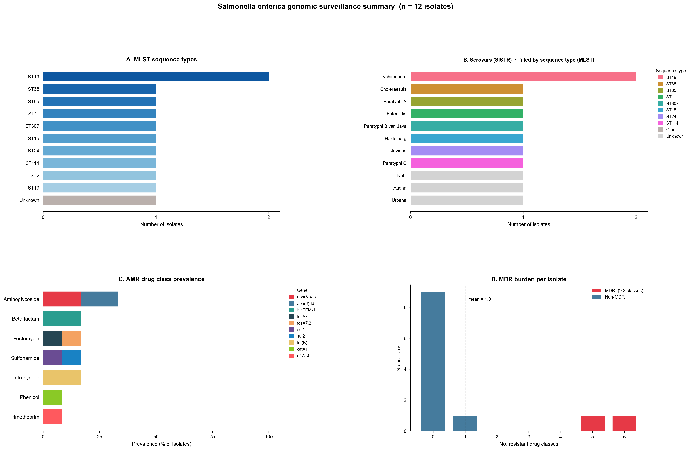
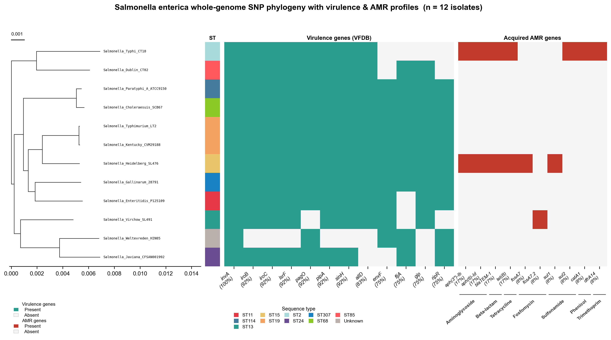
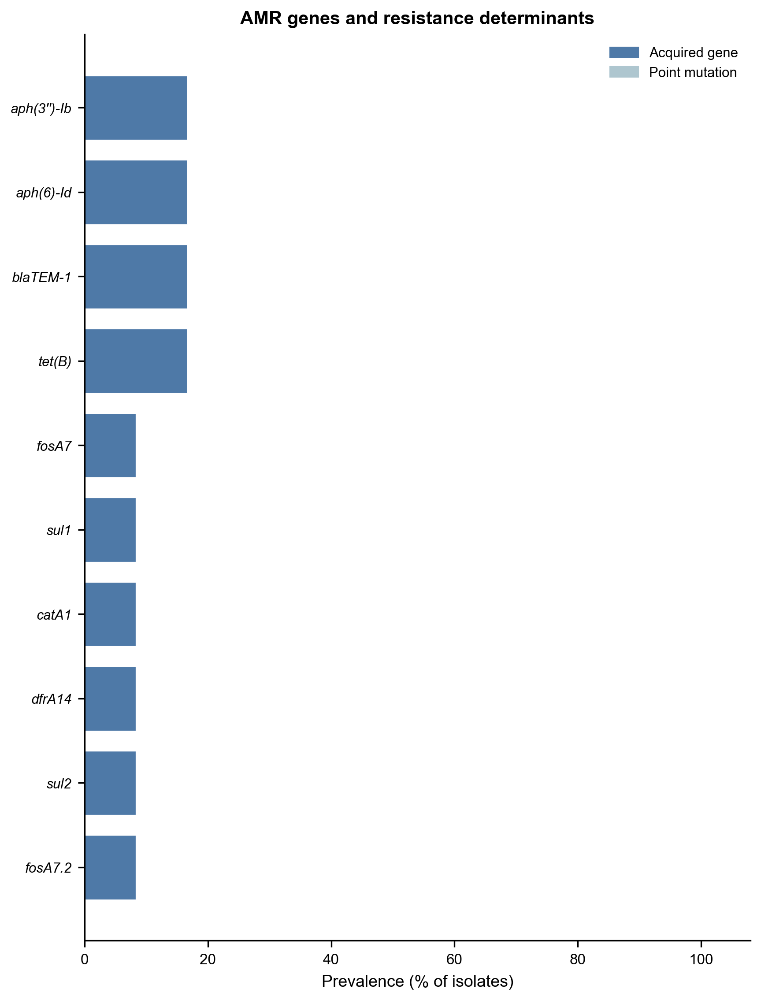
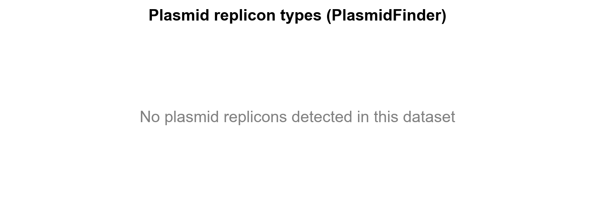
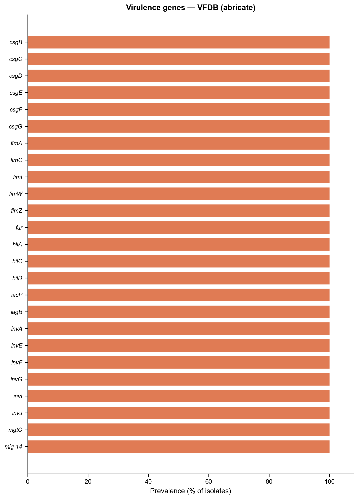
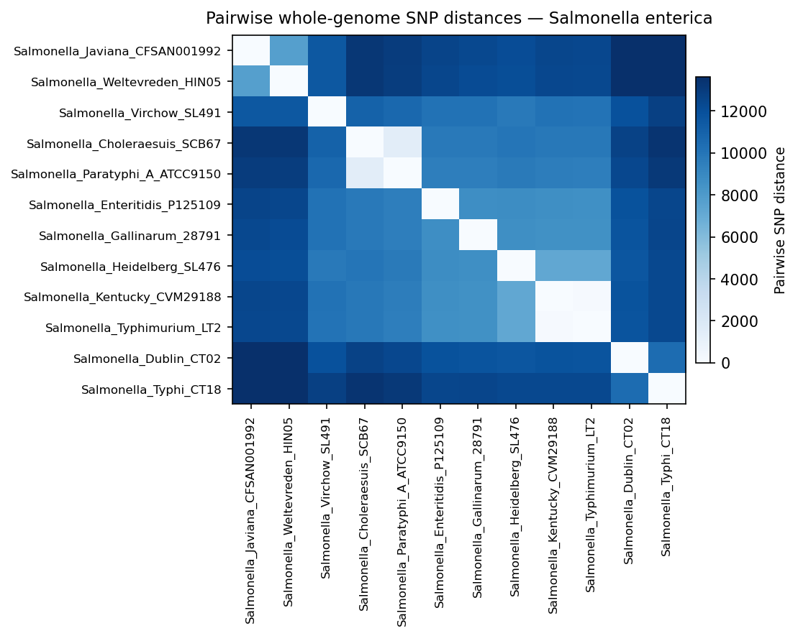

# Vignette: *Salmonella enterica* — reference genome panel (n = 12)

This vignette demonstrates the outputs produced by **enteric-typer** when run on
12 *Salmonella enterica* genome assemblies representing clinically and
epidemiologically important serovars from diverse lineages.

---

## Sample set

Assemblies were sourced from NCBI RefSeq. The panel was designed to span a broad
range of serovars, sequence types, and pathotypes, including typhoidal (Typhi,
Paratyphi) and non-typhoidal serovars, as well as host-restricted (Gallinarum)
and broad-host-range lineages.

| Sample | Serovar | MLST ST | ST complex | NCBI Accession |
|---|---|---|---|---|
| Salmonella_Choleraesuis_SCB67 | Choleraesuis | ST68 | ST68 complex | [GCF_000008105.1](https://www.ncbi.nlm.nih.gov/datasets/genome/GCF_000008105.1/) |
| Salmonella_Dublin_CT02 | Paratyphi A | ST85 | — | [GCF_000020925.1](https://www.ncbi.nlm.nih.gov/datasets/genome/GCF_000020925.1/) |
| Salmonella_Enteritidis_P125109 | Enteritidis | ST11 | ST11 complex | [GCF_000009505.1](https://www.ncbi.nlm.nih.gov/datasets/genome/GCF_000009505.1/) |
| Salmonella_Gallinarum_28791 | Paratyphi B var. Java | ST307 | — | [GCF_000009525.1](https://www.ncbi.nlm.nih.gov/datasets/genome/GCF_000009525.1/) |
| Salmonella_Heidelberg_SL476 | Heidelberg | ST15 | — | [GCF_000020705.1](https://www.ncbi.nlm.nih.gov/datasets/genome/GCF_000020705.1/) |
| Salmonella_Javiana_CFSAN001992 | Javiana | ST24 | — | [GCF_000341425.1](https://www.ncbi.nlm.nih.gov/datasets/genome/GCF_000341425.1/) |
| Salmonella_Kentucky_CVM29188 | Typhimurium | ST19 | ST19 complex | [GCF_000170195.2](https://www.ncbi.nlm.nih.gov/datasets/genome/GCF_000170195.2/) |
| Salmonella_Paratyphi_A_ATCC9150 | Paratyphi C | ST114 | — | [GCF_000011885.1](https://www.ncbi.nlm.nih.gov/datasets/genome/GCF_000011885.1/) |
| Salmonella_Typhi_CT18 | Typhi | ST2 | — | [GCF_000195995.1](https://www.ncbi.nlm.nih.gov/datasets/genome/GCF_000195995.1/) |
| Salmonella_Typhimurium_LT2 | Typhimurium | ST19 | ST19 complex | [GCF_000006945.2](https://www.ncbi.nlm.nih.gov/datasets/genome/GCF_000006945.2/) |
| Salmonella_Virchow_SL491 | Agona | ST13 | — | [GCF_000171535.2](https://www.ncbi.nlm.nih.gov/datasets/genome/GCF_000171535.2/) |
| Salmonella_Weltevreden_HIN05 | Urbana | — | — | Local collection |

---

## Run command

```bash
CONDA_SUBDIR=osx-64 nextflow run main.nf \
    -profile conda,arm64 \
    --input_dir test_salmonella_genomes/ \
    --outdir results/
```

---

## Output table (`salmonella_typer_results.tsv`)

One row per sample. Key columns:

| Column | Description |
|---|---|
| `mlst_st` | Achtman 7-gene MLST sequence type (`senterica_achtman_2` scheme) |
| `mlst_st_complex` | MLST ST complex (where defined) |
| `sistr_serovar` | Predicted serovar (SISTR, Kauffmann-White scheme) |
| `sistr_serovar_antigen` | Predicted antigen formula |
| `sistr_cgmlst_ST` | cgMLST330 sequence type (SISTR) |
| `sistr_O` / `sistr_H1` / `sistr_H2` | Predicted O and H antigens |
| `sistr_qc` | SISTR QC status (PASS / WARNING / FAIL) |
| `amrfinder_acquired_genes` | Acquired AMR genes (intrinsic genes excluded by AMRrules) |
| `amrfinder_drug_classes` | Drug classes with acquired resistance |
| `abricate_vfdb_genes` | Virulence factor genes detected by VFDB via Abricate |
| `plasmidfinder_replicons` | Plasmid replicon types detected by PlasmidFinder |

---

## Figures

### Fig 1 — Population summary

**Figure 1. Population-level summary of 12 *Salmonella enterica* reference genomes.**
Four panels are shown. **(A)** Sequence type (ST) distribution: horizontal bar chart
showing the number of isolates per MLST ST (Achtman 7-gene scheme,
`senterica_achtman_2`). ST19 is the most common, represented by both
*S*. Typhimurium LT2 and *S*. Kentucky CVM29188.
**(B)** Serovar distribution coloured by MLST ST: stacked horizontal bar chart
where each bar represents a serovar predicted by SISTR (Kauffmann-White scheme)
and fill colours indicate the constituent MLST sequence types, enabling rapid
assessment of serovar–ST concordance.
**(C)** Acquired AMR drug class prevalence: horizontal bar chart showing the
proportion of isolates carrying at least one acquired resistance gene in each
drug class (intrinsic genes classified by AMRrules are excluded). Three isolates
(*S*. Heidelberg SL476, *S*. Typhi CT18, *S*. Virchow SL491) carry acquired
resistance, spanning aminoglycosides, β-lactams, phenicols, sulfonamides,
tetracyclines, and trimethoprim.
**(D)** Multi-drug resistance (MDR): bar showing the number of isolates with
acquired resistance to ≥ 3 drug classes.



---

### Fig 2 — Whole-genome SNP phylogeny with AMR & virulence profiles

**Figure 2. Whole-genome SNP phylogeny of 12 *Salmonella enterica* reference genomes
annotated with sequence type, virulence, and acquired AMR profiles.**
The maximum-likelihood tree was inferred by IQ-TREE 2 (ModelFinder Plus automatic
model selection) from a whole-genome SNP alignment generated by SKA2 (split
k-mer alignment, k=31) without a reference genome.
The left-most strip encodes **sequence type (ST)**, with each unique ST shown in a
distinct colour and a legend below the figure.
The remaining heatmap columns show **virulence gene presence/absence** (VFDB;
teal = present, light grey = absent) and **acquired AMR gene presence/absence**
(red = present, light grey = absent), with gene names labelled along the bottom.
The scale bar (top left) represents substitutions per site.



---

### Fig 3 — Acquired AMR genes

**Figure 3. Prevalence of acquired antimicrobial resistance genes across 12
*Salmonella enterica* reference genomes.**
Horizontal bar chart showing the number of isolates carrying each acquired AMR
gene detected by AMRFinder Plus. Resistance gene classes are grouped and labelled
along the x-axis. Intrinsic resistance genes (as classified by AMRrules) are
excluded. Acquired genes include aminoglycoside resistance (*aph(3'')-Ib*,
*aph(6)-Id*), β-lactamase (*blaTEM-1*), chloramphenicol acetyltransferase
(*catA1*), dihydrofolate reductase (*dfrA14*), and sulfonamide/tetracycline
resistance (*sul1*, *sul2*, *tet(B)*), predominantly in *S*. Heidelberg SL476
and *S*. Typhi CT18.



---

### Fig 4 — Plasmid replicon types

**Figure 4. Prevalence of plasmid replicon types across 12 *Salmonella enterica*
reference genomes.**
Horizontal bar chart showing the number of isolates in which each plasmid
replicon type was detected by PlasmidFinder (Enterobacteriaceae database).
Replicon prevalence reflects the diversity of plasmid backbones across reference
strains from distinct serovars and lineages.



---

### Fig 5 — Virulence genes

**Figure 5. Prevalence of virulence factor genes across 12 *Salmonella enterica*
reference genomes.**
Horizontal bar chart showing the number of isolates carrying each virulence gene
detected by Abricate against the VFDB database. Genes are ordered by prevalence.
Core virulence factors present in nearly all isolates include Salmonella
pathogenicity island (SPI) invasion genes (*invA*–*invJ*, *sipA*–*sipD*,
*spaO*–*spaS*), SPI-2 effector secretion genes (*ssaC*–*ssaV*, *sseA*–*sseL*),
and regulatory genes (*hilA*, *hilC*, *hilD*, *phoP*, *phoQ*). More variable
factors — including typhoidal Vi antigen biosynthesis genes (*tviA*–*tviE*,
*vexA*–*vexE*) and typhoid toxin genes (*cdtB*, *pltA*–*pltC*) — are present
only in typhoidal serovars (Typhi, Paratyphi A/C).



---

### Fig 6 — Pairwise whole-genome SNP distance heatmap

**Figure 6. Pairwise whole-genome SNP distance heatmap for 12 *Salmonella enterica*
reference genomes.**
Symmetric heatmap of pairwise SNP distances computed from the SKA2 whole-genome
SNP alignment. Samples are ordered by hierarchical clustering of the distance
matrix. Colour intensity encodes SNP distance (lighter = more similar, darker =
more divergent). Closely related pairs (e.g., *S*. Typhimurium LT2 and
*S*. Kentucky CVM29188, both ST19) cluster together with low pairwise distances,
while typhoidal serovars (Typhi, Paratyphi) form a distinct clade reflecting
their restricted host range and convergent genome reduction.


