# Vignette: *Shigella* spp. — reference genomes spanning four species (n = 15)

This vignette demonstrates the outputs produced by **enteric-typer** when run on
15 *Shigella* genome assemblies representing the four recognised species and a
broad diversity of serotypes.

---

## Sample set

Genomes were downloaded from NCBI RefSeq/GenBank as publicly available reference
and type-strain assemblies, selected to cover recognised serotypes across all four
*Shigella* species. The set spans the major clades resolved by whole-genome
phylogenetics and captures the serotypic diversity used to validate ShigEiFinder
and Mykrobe genotyping within the pipeline.

| Attribute | Detail |
|---|---|
| Species | *Shigella boydii* (n = 3), *S. dysenteriae* (n = 3), *S. flexneri* (n = 6), *S. sonnei* (n = 3) |
| Isolates | 15 reference / type-strain assemblies |
| Source | NCBI RefSeq / GenBank |
| Typing | ShigEiFinder v1.3.5; Mykrobe v0.13 (*S. sonnei* / *S. flexneri* panel) |

### Samples

| Sample | Species | ShigEiFinder serotype | MLST ST | Source |
|---|---|---|---|---|
| Sboydii_ATCC9210 | *S. boydii* | SB4 | ST145 | ATCC 9210 |
| Sboydii_sero14_59-248 | *S. boydii* | SB14 | ST1273 | Clinical isolate 59-248 |
| Sboydii_sero3_NCTC9850 | *S. boydii* | SB3 | Unknown | NCTC 9850 |
| Sdysenteriae_E670-74 | *S. dysenteriae* | SD18 (SDPE) | ST273 | Clinical isolate E670-74 |
| Sdysenteriae_sero1_07-3308 | *S. dysenteriae* | SD1 | ST146 | Clinical isolate 07-3308 |
| Sdysenteriae_sero1_ATCC13313 | *S. dysenteriae* | SD1 | ST260 | ATCC 13313 |
| Sflexneri_1b_73-5612 | *S. flexneri* | SF1b | ST245 | Clinical isolate 73-5612 |
| Sflexneri_2a_FDAARGOS74 | *S. flexneri* | SF3a | ST245 | FDA ARGOS isolate 74 |
| Sflexneri_3a_71-2783 | *S. flexneri* | SF3a | ST628 | Clinical isolate 71-2783 |
| Sflexneri_3b_SFL1520 | *S. flexneri* | SF3b | ST1025 | SFL1520 |
| Sflexneri_5a_74-1170 | *S. flexneri* | SF5a | ST245 | Clinical isolate 74-1170 |
| Sflexneri_6_64-5500 | *S. flexneri* | SF6 | ST145 | Clinical isolate 64-5500 |
| Ssonnei_2015AM-1099 | *S. sonnei* | SS | ST152 | Clinical isolate 2015AM-1099 |
| Ssonnei_ATCC29930 | *S. sonnei* | SS | ST152 | ATCC 29930 |
| Ssonnei_AUSMDU00010534 | *S. sonnei* | SS | ST152 | AUSMDU00010534 |

---

## Run command

```bash
nextflow run main.nf \
    -profile conda,arm64 \
    --samplesheet test/shigella_vignette/samplesheet.csv \
    --outdir shigella_results
```

The pipeline automatically routes all 15 assemblies to the Shigella arm based on
Mash-distance species detection (Shigella-priority rule: any sample within Mash
distance 0.025 of a *Shigella* reference is called Shigella, regardless of
proximity to *E. coli*). This is important because *S. sonnei* and some *S. flexneri*
are genomically nested within the *E. coli* species complex.

---

## Output table (`shigella_typer_results.tsv`)

One row per sample. Key columns:

| Column | Description |
|---|---|
| `mlst_st` | Achtman 7-gene MLST sequence type (`ecoli_achtman_4` scheme) |
| `mlst_st_complex` | MLST ST complex (where defined; e.g., ST152 Cplx for *S. sonnei*) |
| `shigeifinder_ipaH` | ipaH invasion gene presence (`+` / `-`) |
| `shigeifinder_virulence_plasmid` | pINV virulence plasmid copy number estimate |
| `shigeifinder_cluster` | ShigEiFinder cluster (C1, C2, C3, CSD1, CSS) |
| `shigeifinder_serotype` | Predicted serotype (SB*, SD*, SF*, SS prefix encodes species) |
| `shigeifinder_o_antigen` | Predicted O-antigen |
| `mykrobe_lineage` / `mykrobe_subclade` | Mykrobe lineage (covers *S. flexneri* and *S. sonnei*) |
| `amrfinder_acquired_genes` | Acquired AMR genes (intrinsic genes excluded) |
| `amrfinder_drug_classes` | Drug classes with acquired resistance |
| `plasmidfinder_replicons` | Plasmid replicon types |
| `pinv_present` | pINV invasion plasmid present (Y / N) by PCR-marker screen |
| `pinv_genes` | Individual pINV marker genes detected |
| `is_elements` | IS element types and copy numbers (e.g., `IS600(7)`) |

---

## Figures

### Fig 1 — Population summary

**Figure 1. Population-level summary of 15 *Shigella* spp. reference assemblies.**
Four panels are shown. **(A)** Sequence type (ST) distribution: horizontal bar chart
of MLST STs by isolate count (Achtman 7-gene scheme), coloured by *Shigella* species
inferred from ShigEiFinder serotype. ST245 is shared by multiple *S. flexneri* subtypes;
ST152 is the pandemic *S. sonnei* ST. **(B)** IS element landscape: compact heatmap of
IS element copy numbers per sample, sorted by species then serotype. IS600 is the
dominant mobile element across *S. flexneri* and *S. boydii*, consistent with its role
in serotype conversion and pathoadaptive evolution. **(C)** Acquired AMR drug class
prevalence: proportion of isolates carrying acquired resistance in each drug class
(intrinsic genes excluded). Beta-lactam and efflux resistance are near-universal due to
chromosomal `cirA` mutations and efflux pumps; acquired resistance to aminoglycosides,
tetracycline, phenicol, and trimethoprim reflects mobile element–mediated acquisition.
**(D)** Multi-drug resistance (MDR): proportion of isolates with acquired resistance to
≥ 3 drug classes.

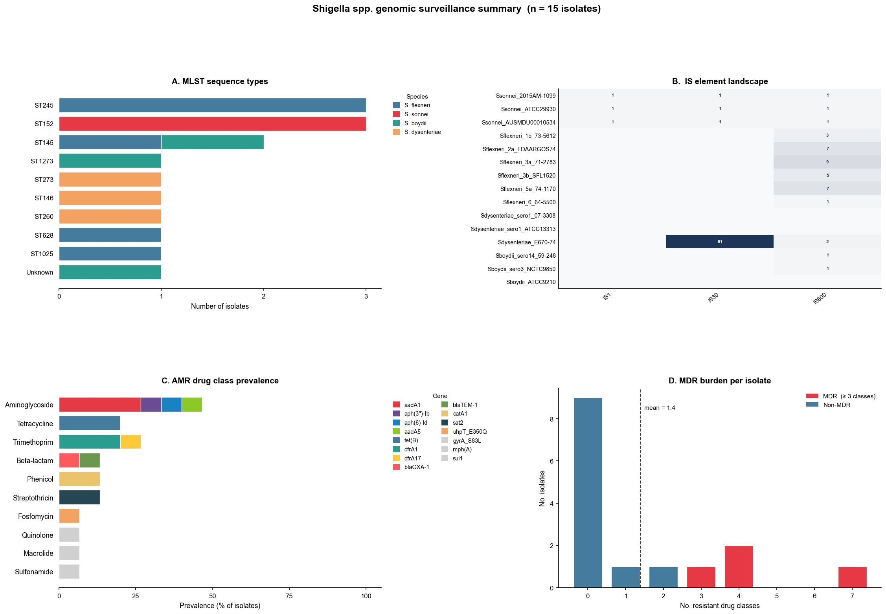

---

### Fig 2 — Whole-genome SNP phylogeny with AMR & virulence profiles

**Figure 2. Whole-genome SNP phylogeny of 15 *Shigella* spp. assemblies, annotated
with sequence type, virulence gene presence/absence, and acquired AMR profiles.**
The maximum-likelihood tree was inferred by IQ-TREE 2 (GTR+G model, 1000 ultrafast
bootstrap replicates) from a whole-genome SNP alignment generated by SKA2 (split
k-mer alignment, k=31) without a reference genome.
The left-most strip encodes **sequence type (ST)** with a colour per unique ST.
Virulence gene columns (teal = present) show the extensive shared invasion machinery
(*ipaH*, pINV, *iucABCD* aerobactin cluster) across all four species, with gene
presence broadly concordant with phylogeny. Acquired AMR columns (red = present)
reveal the multidrug-resistant *S. sonnei* ST152 clade (AUSMDU00010534 carrying
resistance to 10 drug classes) and variable acquired resistance among *S. flexneri*
subtypes. The scale bar represents substitutions per site.

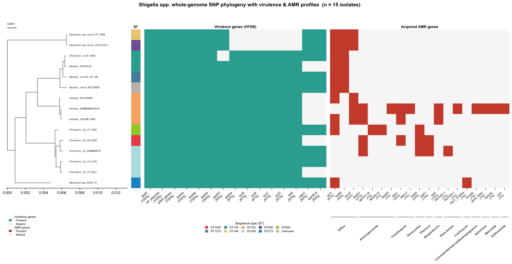

---

### Fig 3 — Acquired AMR genes

**Figure 3. Prevalence of acquired antimicrobial resistance genes across 15 *Shigella*
spp. assemblies.**
Horizontal bar chart showing the number of isolates carrying each acquired AMR gene
detected by AMRFinder Plus (intrinsic genes excluded). Efflux pump genes (`acrF`,
`mdtM`, `emrD`) predominate, reflecting the constitutive efflux background in
*Shigella*. Beta-lactam resistance is driven by `cirA` frameshift and nonsense
mutations (chromosomal, classified as acquired in the context of clinical resistance)
and `blaOXA-1` / `blaTEM-1`. Aminoglycoside resistance (`aadA1`, `aph(3'')-Ib`,
`aph(6)-Id`, `aadA5`) and tetracycline resistance (`tet(B)`) are carried primarily
on IncFII plasmids. The highly MDR *S. sonnei* AUSMDU00010534 contributes multiple
unique genes including `gyrA_S83L` (fluoroquinolone), `erm(B)` and `mph(A)`
(macrolide/lincosamide/streptogramin), `sul1`, and `nfsA` mutations (nitrofuran).

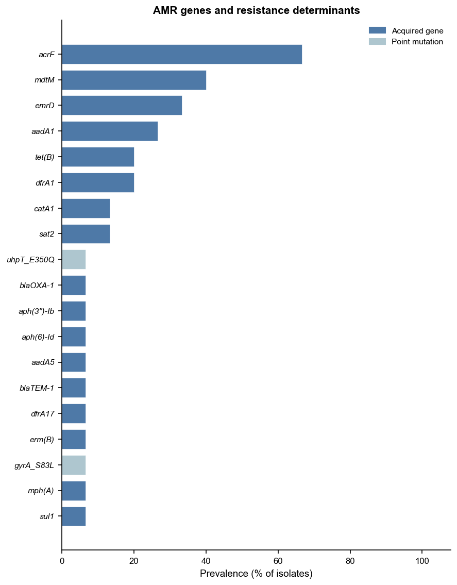

---

### Fig 4 — Plasmid replicon overview

**Figure 4. Plasmid replicon overview across 15 *Shigella* spp. assemblies.**
Three-panel figure summarising plasmid replicon diversity.
**(A)** Horizontal stacked-bar chart showing the prevalence of the top replicon
types, coloured by dominant AMR drug class. IncFII is the dominant replicon,
detected across *S. boydii*, *S. flexneri*, and *S. dysenteriae*, consistent
with the pINV large virulence plasmid being IncFII-type in most lineages.
Col156 is detected exclusively in all three *S. sonnei* isolates and is the
characteristic small cryptic plasmid of the *S. sonnei* pandemic lineage.
IncI1 and IncFII(pSE11) co-occur with heavy AMR burden in *S. flexneri* 3a
and the MDR *S. sonnei* isolate respectively.
**(B)** Bubble matrix of replicon–AMR drug-class co-occurrence.
**(C)** Midpoint-rooted whole-genome SNP phylogeny (IQ-TREE 2) with ST
annotation strip and a per-isolate plasmid replicon presence/absence heatmap
(blue = present, white = absent).

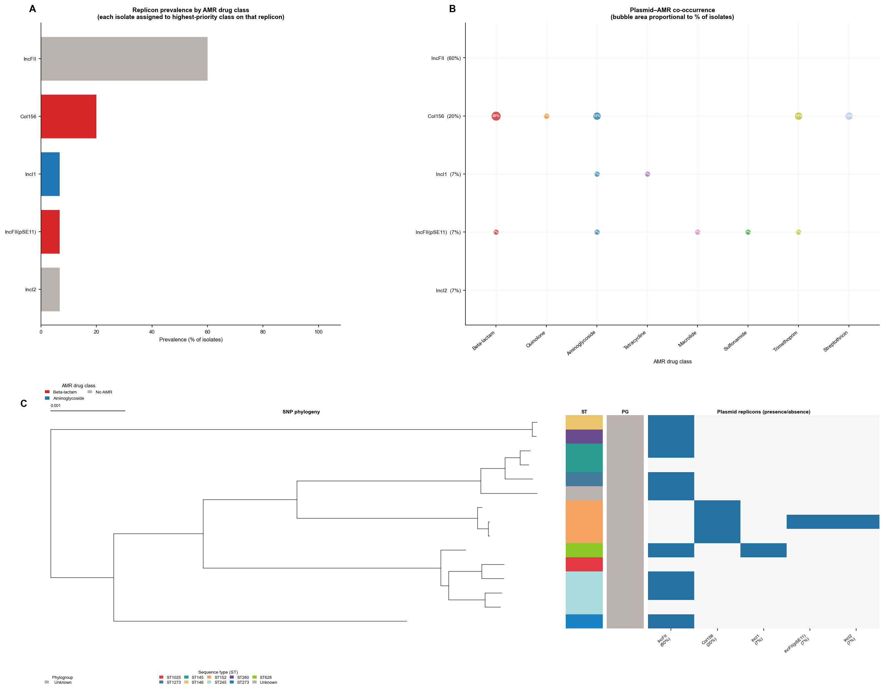

---

### Fig 5 — Virulence gene prevalence

**Figure 5. Prevalence of virulence factors across 15 *Shigella* spp. assemblies.**
Horizontal bar charts showing the proportion of isolates carrying each virulence
gene or factor detected by AMRFinder Plus (VFDB). Core invasion machinery genes
(*ipaH* homologues, *iucABCD* aerobactin biosynthesis, *ipaHa/b/d*) are near-universal.
Shiga toxin genes (*stxA1*, *stxB1*, *stx1a_operon*) are restricted to the
*S. dysenteriae* serotype 1 isolates, consistent with the known presence of the
Stx1-encoding prophage in this serotype. Iron acquisition (*iroB/C/D/E/N*) is also
exclusive to SD1.

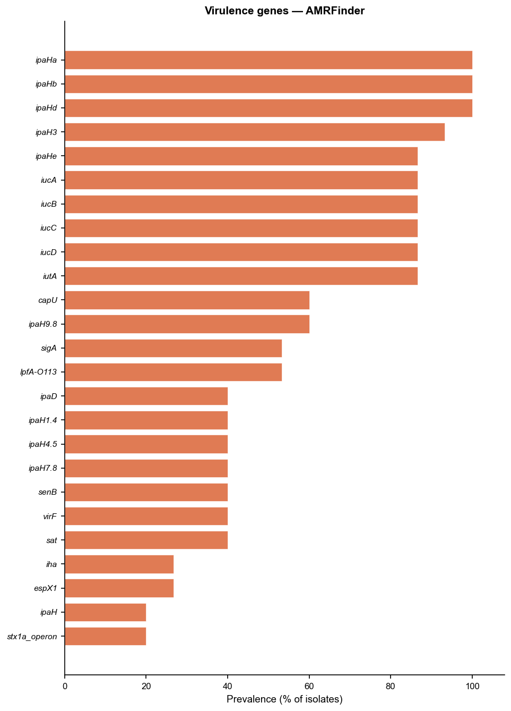

---

### Fig 6 — AMR drug class prevalence by sequence type

**Figure 6. AMR drug class prevalence by MLST sequence type (ST) across 15 *Shigella*
spp. assemblies.**
Tile heatmap showing the percentage of isolates within each ST carrying acquired
resistance to each drug class. ST152 (*S. sonnei*) shows the broadest resistance
spectrum, reaching 100% prevalence for efflux and beta-lactam, and high prevalence
for aminoglycosides, macrolides, quinolones, streptothricin, sulfonamides, and
trimethoprim. ST245 (*S. flexneri*, multiple subtypes) shows variable resistance
reflecting serotype-specific accessory genome differences.

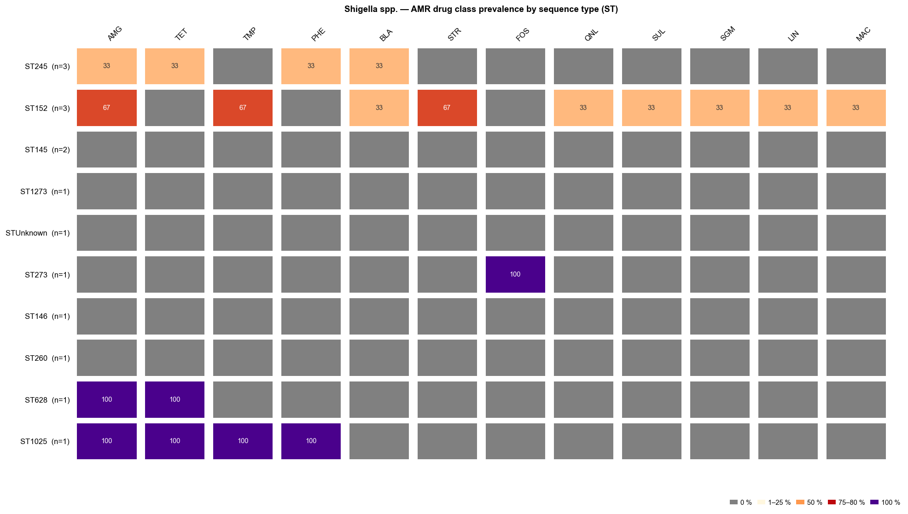

---

### Fig 7 — AMR drug class prevalence by species

**Figure 7. AMR drug class prevalence by *Shigella* species across 15 assemblies.**
Tile heatmap showing the percentage of isolates within each species carrying acquired
resistance to each drug class. *S. sonnei* exhibits the highest resistance burden
across classes, consistent with the pandemic ST152 clone accumulating resistance
through successive selective sweeps. *S. dysenteriae* shows beta-lactam and efflux
resistance but lower acquisition of mobile resistance elements in this reference set.
*S. flexneri* and *S. boydii* display intermediate resistance profiles.

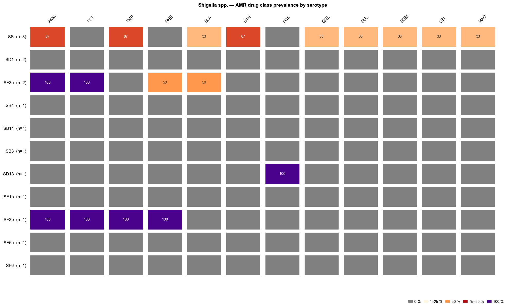

---

### Fig 8 — Serotype composition

**Figure 8. *Shigella* serotype composition across 15 assemblies, stratified by species.**
Horizontal stacked bar chart where each bar represents a species and stacked
segments show the proportion of each ShigEiFinder-predicted serotype. *S. sonnei*
has a single serotype (SS). *S. flexneri* is represented by five serotypes (SF1b,
SF3a, SF3b, SF5a, SF6) spanning the major subtype diversity. *S. boydii* and
*S. dysenteriae* each show two serotypes (SB3/SB4/SB14 and SD1/SD18 respectively).

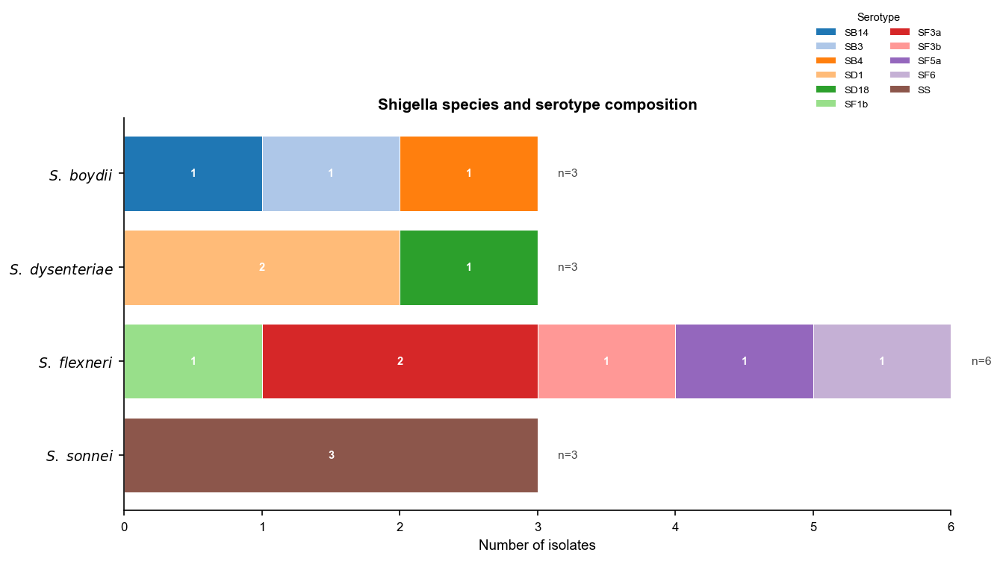

---

### Fig 9 — Virulence & invasion feature panel

**Figure 9. Shigella virulence and invasion feature panel for 15 assemblies.**
Binary heatmap (present = dark red, absent = white) showing three groups of features:
**ShigEiFinder markers** (ipaH, virulence plasmid presence), **pINV invasion plasmid
marker genes** (icsA/virG, virF, virB, ipaB, ipaC, ipaD), and **IS element types**
(IS1, IS1A, IS30, IS186, IS600, IS629). All 15 isolates carry ipaH, confirming their
classification as invasive *Shigella*. The absence of pINV marker gene calls reflects
the detection thresholds of the marker-gene screen rather than biological absence.
IS600 is the most widely distributed IS element, present in 10/15 isolates and
particularly abundant in *S. flexneri* 3a (9 copies) and 2a (7 copies), consistent
with IS600-mediated serotype conversion events. IS30 at very high copy number (61
copies) in *S. dysenteriae* E670-74 is consistent with its documented role in
genome rearrangements in this lineage. IS1 is restricted to *S. sonnei*.

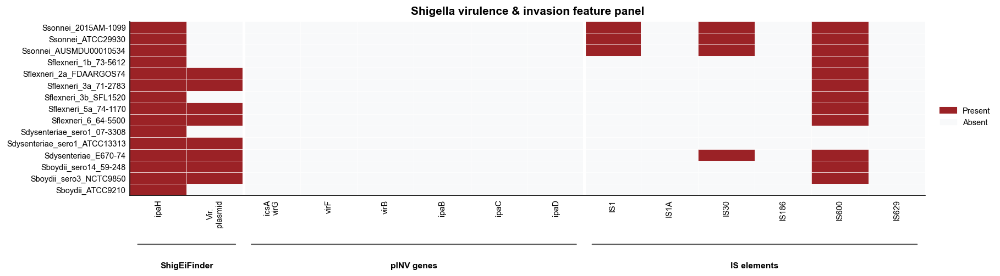

---

### SNP distance heatmap

**Supplementary. Pairwise whole-genome SNP distance heatmap for 15 *Shigella* spp.
assemblies.**
Symmetric heatmap of pairwise SNP distances from the SKA2 whole-genome alignment.
Samples are ordered by hierarchical clustering. The four *Shigella* species form
clearly separated blocks, with the closest distances within *S. flexneri* ST245
subtypes and within *S. sonnei* ST152 (all three isolates highly related). Larger
inter-species distances reflect the deep divergence between *Shigella* lineages,
which span approximately 25,000–50,000 SNPs across the core genome.

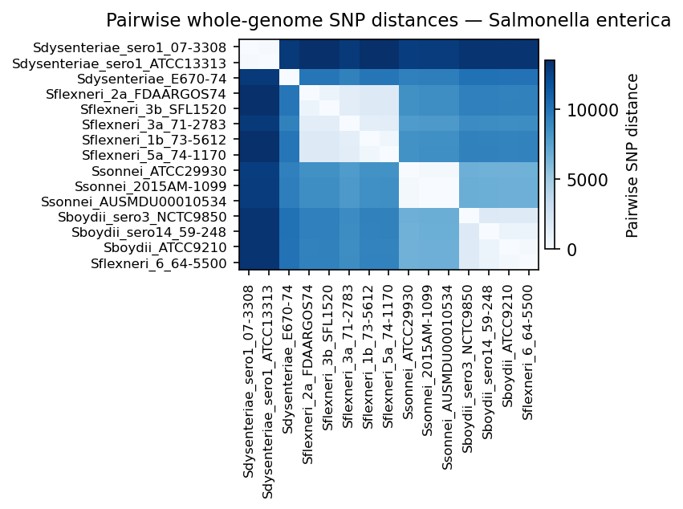

---

### Assembly quality metrics

**Assembly quality metrics for 15 *Shigella* spp. reference assemblies.**
Eight-panel figure summarising per-assembly statistics computed by enteric-typer,
presented as paired histogram and box plot for each metric.
**(A–B)** Genome length (bp). **(C–D)** N50 (bp). **(E–F)** Number of contigs.
**(G–H)** GC content (%). Dashed reference lines indicate expected values for
*Shigella* spp. (genome length ~4.5 Mb; GC% ~51 %).

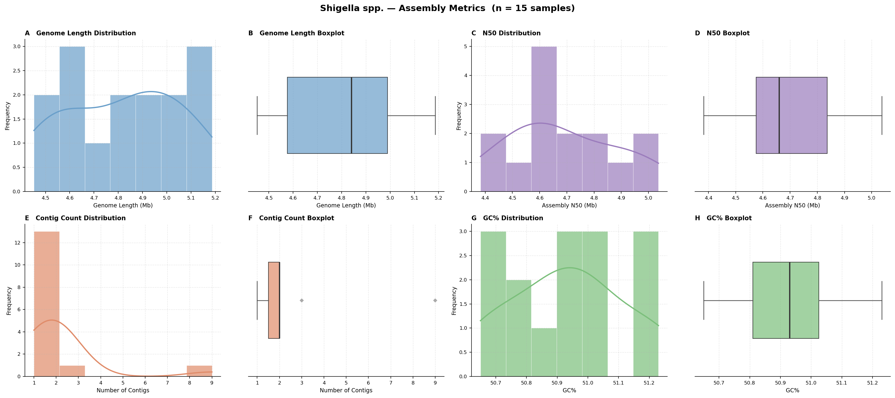
